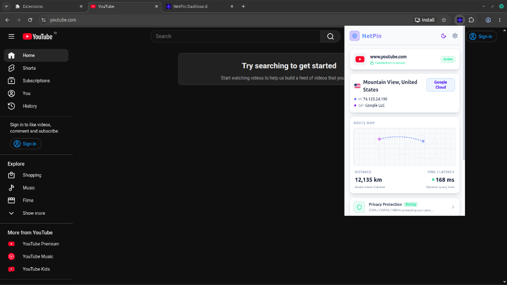
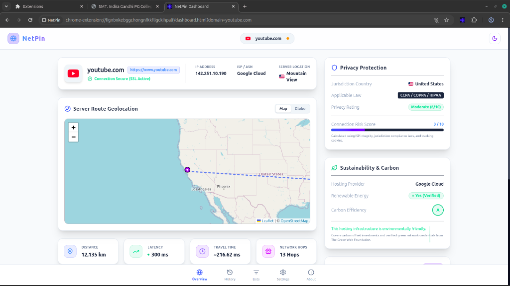
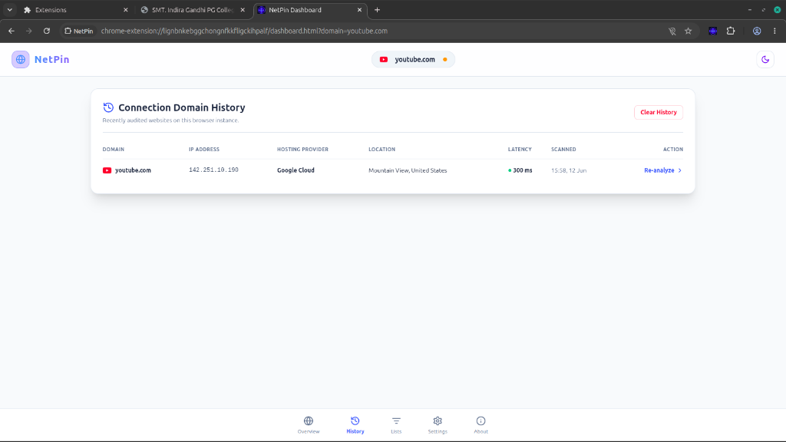
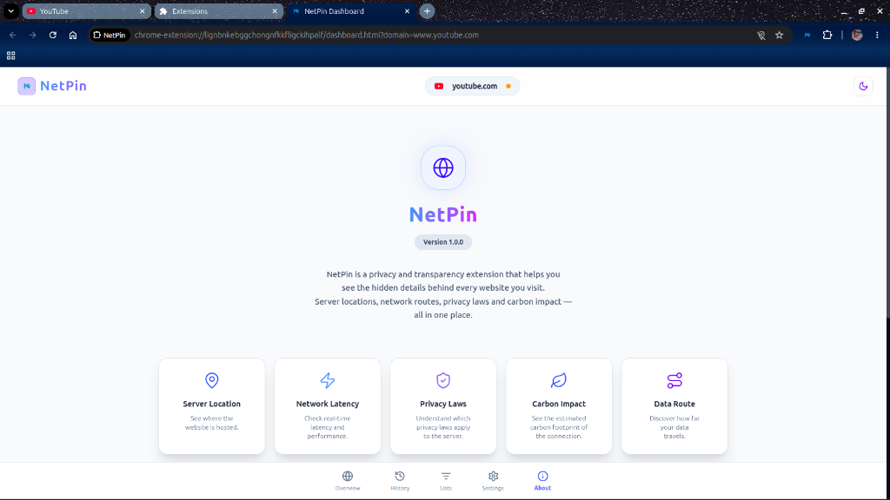

# NetPin

NetPin is an open source Chrome extension that gives you transparent details about the websites you visit. It provides real-time information on server location coordinates, network latency pathways, carbon footprint scores, localized privacy protection laws, and detailed domain intelligence including WHOIS registrar data, DNS records, and privacy masking detection.

With its sleek glassmorphic UI, animated interactive globe, and integrated dark/light modes, NetPin empowers you to take back control of your data by seeing exactly where it goes.

## Snapshots

#### Extension Popup


#### Dashboard Overview


#### Connection History


#### Dashboard About


## Installation & Local Setup

To clone this repository and run the extension locally on your own machine, follow these steps:

1. **Clone the repository:**
   ```bash
   git clone https://github.com/01iamysf/NetPin.git
   cd NetPin
   ```

2. **Install dependencies:**
   Make sure you have [Node.js](https://nodejs.org/) installed, then run:
   ```bash
   npm install
   ```

3. **Run the Development Server:**
   If you want to modify the code and see changes instantly with hot-reloading:
   ```bash
   npm run dev
   ```

4. **Build the Extension for Production:**
   When you are ready to load the extension into Chrome, build the production bundle:
   ```bash
   npm run build
   ```
   This will generate a `dist` folder in the root directory.

5. **Load into Chrome:**
   - Open your Chromium browser (Chrome, Edge, Brave, etc.) and navigate to `chrome://extensions/`
   - Enable the **Developer mode** toggle in the top right corner.
   - Click the **Load unpacked** button.
   - Select the `dist` folder that was just generated in your `NetPin` directory.

## How to Use It

1. **Visit a Website**: Once installed, navigate to any website (e.g., `github.com`).
2. **Open the Popup**: Click the NetPin extension icon in your browser toolbar. If Auto-Analyze is turned off, click "Start Analysis".
3. **View the Popup Insights**: The popup will display a quick summary, including the server's country, IP address, hosting provider, distance, and latency.
4. **Open the Full Dashboard**: Click the "Open Full Dashboard" button in the popup to explore the data in depth.
   - **Overview Tab**: Explore the interactive Server Route Geolocation (Map & Globe views), examine the Connection Data Journey (hop-by-hop tracking), and review the Domain Intelligence & WHOIS data (including DNS records and privacy protection statuses).
   - **History Tab**: See a record of recently audited websites, along with their latencies and host data.
   - **Lists Tab**: Manage local domain blocking rules, allowing you to configure tracker blocking manually.

## Contributing

NetPin is an open source project and anyone is welcome to contribute. 

If you find a bug or run into any issues, please raise an issue in the repository. 

If you have a new idea or want to request a feature, feel free to open a discussion or an issue. Pull requests are also appreciated if you want to write the code yourself.

## License

This project is open source and available under the MIT License.
